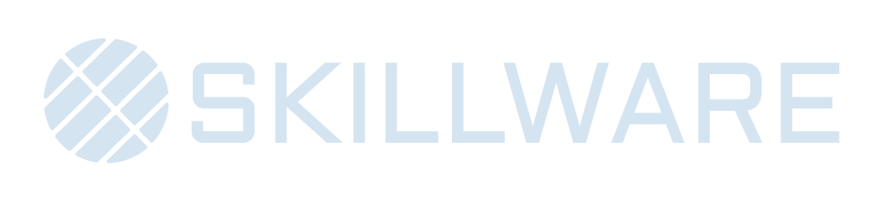

<div align="center">
  

  A Python framework for modular, self-contained skill management for machines.
</div>

<br/>

<div align="center">
  
  
  
</div>

<br/>

<div align="center">
  <a href="#mission">Mission</a> •
  <a href="#repository-structure">Architecture</a> •
  <a href="#quick-start">Quick Start</a> •
  <a href="#documentation">Documentation</a> •
  <a href="#contributing">Contributing</a> •
  <a href="#comparison">Comparison</a> •
  <a href="#contact">Contact</a>
</div>

---

**Skillware** is an open-source framework and registry for modular, actionable Agent capabilities. It treats **Skills** as installable content, decoupling capability from intelligence. Just as `apt-get` installs software and `pip` installs libraries, `skillware` installs *know-how* for AI agents.

> "I know Kung Fu." - Neo

## Mission

The AI ecosystem is fragmented. Developers often re-invent tool definitions, system prompts, and safety rules for every project. **Skillware** supplies a standard to package capabilities into self-contained units that work across **Gemini**, **Claude**, **GPT**, and **Llama**.

A **Skill** in this framework provides everything an Agent needs to master a domain:

1.  **Logic**: Executable Python code.
2.  **Cognition**: System instructions and "cognitive maps".
3.  **Governance**: Constitution and safety boundaries.
4.  **Interface**: Standardized schemas for LLM tool calling.

## Repository Structure

This repository is organized into a core framework, a registry of skills, and documentation.

```text
Skillware/
Skillware/
├── skillware/                  # Core Framework Package
│   └── core/
│       ├── base_skill.py       # Abstract Base Class for skills
│       ├── loader.py           # Universal Skill Loader & Model Adapter
│       └── env.py              # Environment Management
├── skills/                     # Skill Registry (Domain-driven)
│   └── finance/
│       └── wallet_screening/ 
│           ├── skill.py        # Logic
│           ├── manifest.yaml   # Metadata & Constitution
│           ├── instructions.md # Cognitive Map
│           ├── card.json       # UI Presentation
│           ├── data/           # Integrated Knowledge Base
│           └── maintenance/    # Maintenance Tools
├── templates/                  # New Skill Templates
│   └── python_skill/           # Standard Python Skill Template
├── examples/                   # Reference Implementations
│   ├── gemini_wallet_check.py  # Google Gemini Integration
│   └── claude_wallet_check.py  # Anthropic Claude Integration
├── docs/                       # Comprehensive Documentation
│   ├── introduction.md         # Philosophy & Design
│   ├── usage/                  # Integration Guides
│   └── skills/                 # Skill Reference Cards
└── COMPARISON.md               # Comparison vs. Anthropic Skills / MCP
```

## Quick Start

### 1. Installation

Clone the repository and install the dependencies.

```bash
git clone https://github.com/arpa/skillware.git
cd skillware
pip install -r requirements.txt
```

> **Note**: Individual skills may have their own dependencies. The `SkillLoader` validates `manifest.yaml` and warns of missing packages (e.g., `requests`, `pandas`) upon loading a skill.

### 2. Configuration

Create a `.env` file with your API keys (e.g., Google Gemini API Key):

```ini
GOOGLE_API_KEY="your_key"
```

### 3. Usage Example (Gemini)

```python
import google.generativeai as genai
from skillware.core.loader import SkillLoader
from skillware.core.env import load_env_file

# Load Environment
load_env_file()

# 1. Load the Skill
# The loader reads the code, manifest, and instructions automatically
skill_bundle = SkillLoader.load_skill("finance/wallet_screening")

# 2. Model & Chat Setup
model = genai.GenerativeModel(
    'gemini-2.5-flash',
    tools=[SkillLoader.to_gemini_tool(skill_bundle)], # The "Adapter"
    system_instruction=skill_bundle['instructions']   # The "Mind"
)
chat = model.start_chat(enable_automatic_function_calling=True)

# 3. Agent Loop
# The SDK handles the loop: model -> tool call -> execution -> result -> model reply.
response = chat.send_message("Screen wallet 0xd8dA... for risks.")
print(response.text)
```

## Documentation

*   **[Core Logic & Philosophy](docs/introduction.md)**: Details on how Skillware decouples Logic, Cognition, and Governance.
*   **[Usage Guide: Gemini](docs/usage/gemini.md)**: Integration with Google's GenAI SDK.
*   **[Usage Guide: Claude](docs/usage/claude.md)**: Integration with Anthropic's SDK.
*   **[Skill Library](docs/skills/README.md)**: Available capabilities.

## Contributing

We are building the "App Store" for Agents and require professional, robust, and safe skills.

Please read **[CONTRIBUTING.md](CONTRIBUTING.md)** for guidelines on folder structure, manifest schemas, and safety constitutions.

## Comparison

Skillware differs from the Model Context Protocol (MCP) or Anthropic's Skills repository in the following ways:

*   **Model Agnostic**: Native adapters for Gemini, Claude, and OpenAI.
*   **Code-First**: Skills are executable Python packages, not just server specs.
*   **Runtime-Focused**: Provides tools for the application, not just recipes for an IDE.

[Read the full comparison here](COMPARISON.md).

## Contact

For questions, suggestions, or contributions, please open an issue or reach out to us:

*   **Email**: [skillware-os@arpacorp.net](mailto:skillware-os@arpacorp.net)
*   **Issues**: [GitHub Issues](https://github.com/arpa/skillware/issues)

---

<div align="center">
    
    <br/>
    Built & Maintained by ARPA Hellenic Logical Systems
</div>
