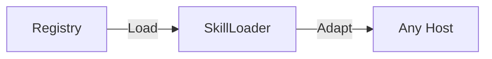
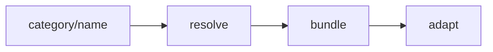

# Deep Dive: The Skillware Philosophy

**Skillware** is an Operating System for Agentic Capabilities. It decouples *intelligence* (the model) from *capability* (the tool): you **install** know-how instead of redefining it for every host.

## Skill anatomy

Every registry skill is a folder of **roles** implemented by fixed filenames. The [README Mission](../README.md#mission) summarizes the core roles; the full reference is below. Filenames stay unchanged.

### Grouping

```text
CAPABILITY (what the host unlocks)
├── Contract      manifest.yaml
├── Effect        skill.py (+ effect modules in the same folder)
└── Directive     instructions.md

REGISTRY (required to merge)
├── Assurance     test_skill.py
└── Presentation  card.json

OPTIONAL ASSETS
├── Corpus        kb/, data/, bundled knowledge files
└── Reference     schemas/, maps, in-bundle spec fixtures

FRAMEWORK (outside the bundle folder)
└── Interface     SkillLoader model adapters (to_gemini_tool, …)
```

### Role reference

| Role | v0 file(s) | What it answers |
| :--- | :--- | :--- |
| **Contract** | `manifest.yaml` | What is this skill? Typed I/O, `constitution`, issuer, `requirements` |
| **Effect** | `skill.py` | What runs deterministically when invoked? (`BaseSkill.execute()`) |
| **Directive** | `instructions.md` | How should the host use this capability? When, how to read outputs, limits |
| **Assurance** | `test_skill.py` | Does Effect honor Contract? (offline bundle tests; CI / `skillware test`) |
| **Presentation** | `card.json` | Catalog and UI card metadata; issuer must match Contract when present |
| **Corpus** | `kb/`, `data/`, … | Static knowledge Effect reads (not fetched at runtime) |
| **Reference** | `schemas/`, maps | Machine-readable adjuncts to Contract (validators, terminology) |
| **Interface** | `skillware/core/loader.py` | Adapters that expose Contract to a host API |

**Effect modules** — co-located Python imported by `skill.py` (for example `workflow.py`, `budget.py`). Part of Effect implementation, not separate bundle roles.

**Corpus tooling** — offline scripts under the bundle (for example `maintenance/`) that refresh Corpus data. Not loaded by `execute()`.

**Constitution vs directive** — hard limits and registry identity live in **Contract** (`manifest.yaml`). Operational playbook for the host lives in **Directive** (`instructions.md`). Both constrain behavior; different consumers.

**Presentation** — `card.json` is part of the standard registry bundle (every skill under `skills/` ships one). CI validates issuer parity and UI schema keys when a card is present; see [CONTRIBUTING](../CONTRIBUTING.md#4-cardjson-presentation).

---

## The Architecture: How It Works

Skillware relies on a strict, modular layout. Capabilities live under `skills/` grouped by domain (see [Skill categories](../CONTRIBUTING.md#skill-categories)):

```text
Skillware/
├── skills/
│   └── category/                   # Domain boundary (e.g., 'finance')
│       └── skill_name/             # A self-contained capability bundle
│           ├── manifest.yaml       # Contract
│           ├── skill.py            # Effect (entry)
│           ├── instructions.md     # Directive
│           ├── card.json           # Presentation
│           ├── test_skill.py       # Assurance
│           ├── kb/ or data/        # Corpus (optional)
│           └── schemas/            # Reference (optional)
└── skillware/
    └── core/
        ├── base_skill.py           # Effect interface (`BaseSkill`)
        ├── env.py                  # API key and secret loading
        └── loader.py               # Interface: loader and model adapters
```



A skill is a folder on disk. The loader reads Contract and Directive, exposes **Interface** adapters, and your host runs the loop. See [How it works](../README.md#how-it-works) and [Agent Loops](usage/agent_loops.md).

When you run `SkillLoader.load_skill("category/skill_name")`:



### Step 1: Discovery & Loading

The loader resolves `category/skill_name` against configured skill roots (run `skillware paths` and `skillware config show` for the live order). Bundled registry skills remain available after `pip install skillware` even without a local `skills/` tree.

- Dynamically imports `skill.py` and discovers the single `BaseSkill` subclass as `bundle["class"]`.
- Parses `manifest.yaml` (including `issuer` for attribution).
- Reads `instructions.md` and `card.json`.

For provenance tiers and operator security, see [Skill trust model](security/skill-trust-model.md).

### Step 2: Adaptation (Interface)

Every model expects a different tool-schema shape. The **Interface** layer transmutes Contract into host formats:

- `SkillLoader.to_gemini_tool(skill)` — Gemini `FunctionDeclaration`
- `SkillLoader.to_claude_tool(skill)` — Claude tools + JSON Schema
- `SkillLoader.to_openai_tool(skill)` — OpenAI Chat Completions tools
- `SkillLoader.to_deepseek_tool(skill)` — DeepSeek-compatible tools
- `SkillLoader.to_ollama_prompt(skill)` — textual tool block for Ollama loops

### Step 3: Directive injection

Pass **`instructions.md`** (**Directive**) into the host system prompt. The model learns when to invoke the skill, how to read outputs, and operational limits — not a replacement host persona.

---

## The Execution Loop

1.  **User Query**: "Should this agent loop stop — we're at 95k tokens?"
2.  **Host reads Directive**: The model sees injected `instructions.md` and selects `monitoring/token_limiter`.
3.  **Tool Call**: The model emits a structured tool call via **Interface** adapters.
4.  **Framework Execution**: Your script may call `skill.validate_params(...)` before `execute()` (recommended in production loops).
5.  **Effect runs**: `skill.py` evaluates the budget and returns structured JSON.
6.  **Synthesis**: The model receives the result and explains the next step to the user.

## Model Agnosticism

Skillware is designed to be the "Standard Library" for all agents.

| Platform | Integration Strategy |
| :--- | :--- |
| **Google Gemini** | Native `google-genai` support. Automatic type mapping. |
| **Anthropic Claude** | Native `anthropic` support. XML/JSON handling. |
| **Ollama** | Native `ollama` Python client support. Fully local JSON handling. |
| **OpenAI GPT** | `to_openai_tool()`; Chat Completions tool calling. |
| **DeepSeek** | `to_deepseek_tool()`; separate adapter, OpenAI-compatible client. |
| **Local LLaMA** | (Planned) GBNF Grammar generation from manifests. |

---
**Next Steps:**
*   Read the [Vision](vision.md) (story, roadmap, and where we are today)
*   Explore the [Skill Library](skills/README.md)
*   Browse the [Runnable Examples Index](../examples/README.md)
*   View the [Changelog](../CHANGELOG.md) for release history
*   Read [How to Contribute](../CONTRIBUTING.md) (skills, docs, framework, and bugs)
*   If you are a contributing agent, follow the [Agent Contribution Workflow](contributing/ai_native_workflow.md)
