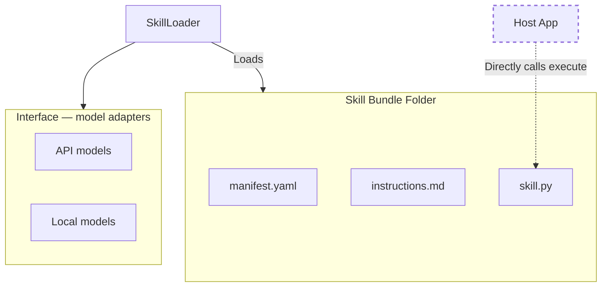
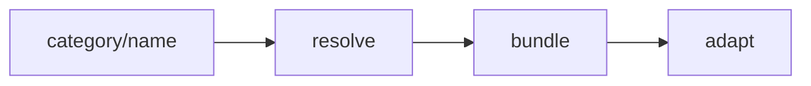

# Deep Dive: The Skillware Philosophy

**Skillware** is an Operating System for Agentic Capabilities. It was born from the realization that current agent frameworks (LangChain, AutoGPT) couple *intelligence* (the model) too tightly with *capability* (the tool).

If you want your agent to "know" how to analyze a balance sheet, you shouldn't have to prompt-engineer a specific model or write a custom tool definition for that specific model's API. You should be able to **install** that capability.

## Skill anatomy

Every registry skill is a folder of **roles** implemented by fixed filenames in v0. The [README Mission](../README.md#mission) summarizes the core roles; optional assets and the full reference are below. Filenames stay unchanged.

### Grouping

```text
CAPABILITY (what the host unlocks)
├── Contract      manifest.yaml
├── Effect        skill.py (+ effect modules in the same folder)
└── Directive     instructions.md

REGISTRY (required to merge)
└── Assurance      test_skill.py

OPTIONAL ASSETS
├── Corpus         kb/, data/, bundled knowledge files
├── Reference      schemas/, maps, in-bundle spec fixtures
└── Presentation   card.json

FRAMEWORK (outside the bundle folder)
└── Interface      SkillLoader model adapters (to_gemini_tool, …)
```

### Role reference

| Role | v0 file(s) | What it answers |
| :--- | :--- | :--- |
| **Contract** | `manifest.yaml` | What is this skill? Typed I/O, `constitution`, issuer, `requirements` |
| **Effect** | `skill.py` | What runs deterministically when invoked? (`BaseSkill.execute()`) |
| **Directive** | `instructions.md` | How should the host use this capability? When, how to read outputs, limits |
| **Assurance** | `test_skill.py` | Does Effect honor Contract? (offline bundle tests; CI / `skillware test`) |
| **Corpus** | `kb/`, `data/`, … | Static knowledge Effect reads (not fetched at runtime) |
| **Reference** | `schemas/`, maps | Machine-readable adjuncts to Contract (validators, terminology) |
| **Presentation** | `card.json` | Optional catalog / UI card metadata |
| **Interface** | `skillware/core/loader.py` | Adapters that expose Contract to a host API |

**Effect modules** — co-located Python imported by `skill.py` (for example `workflow.py`, `budget.py`). Part of Effect implementation, not separate bundle roles.

**Corpus tooling** — offline scripts under the bundle (for example `maintenance/`) that refresh Corpus data. Not loaded by `execute()`.

**Constitution vs directive** — hard limits and registry identity live in **Contract** (`manifest.yaml`). Operational playbook for the host lives in **Directive** (`instructions.md`). Both constrain behavior; different consumers.

Legacy narrative aliases (**Body** = Effect, **Mind** = Directive, **Conscience** = Contract) may appear in older prose; prefer the role names above in new docs. Planned for removal in a later cleanup pass.

---

## The Architecture: How It Works

Skillware relies on a strict, modular layout. Instead of hardcoding tools into your primary application, you maintain a structured registry of capabilities grouped by domain folders under `skills/` (see [Skill categories](../CONTRIBUTING.md#skill-categories) when contributing):

```text
Skillware/
├── skills/
│   └── category/                   # Domain boundary (e.g., 'finance')
│       └── skill_name/             # A self-contained capability bundle
│           ├── manifest.yaml       # Contract
│           ├── skill.py              # Effect (entry)
│           ├── instructions.md       # Directive
│           ├── card.json             # Presentation (optional)
│           ├── test_skill.py         # Assurance
│           ├── kb/ or data/          # Corpus (optional)
│           └── schemas/              # Reference (optional)
└── skillware/
    └── core/
        ├── base_skill.py           # Effect interface (`BaseSkill`)
        ├── env.py                  # API key and secret loading
        └── loader.py               # Interface: loader and model adapters
```



A skill is a folder on disk. The loader turns the manifest into whatever tool schema your runtime expects. For the high-level picture, see [How it works](../README.md#how-it-works); for the code loop that hooks these adapters up, see [Agent Loops](usage/agent_loops.md).

When you run `SkillLoader.load_skill("category/skill_name")`, a complex orchestration happens behind the scenes:

### Step 1: Discovery & Loading
The loader resolves `category/skill_name` to a skill directory by checking, in order: an existing path on disk, then configured skill roots (legacy without YAML: `SKILLWARE_SKILL_PATH` → cwd `skills/` walk → bundled; with `.skillware.yaml` or global config: `resolution.order`, default project → external → bundled, bundled always on). Missing local `skills/` directories are skipped — bundled registry skills remain available after `pip install skillware`. Run `skillware paths` and `skillware config show` for a live view. Each bundle is a directory containing `manifest.yaml` and `skill.py`.
*   It dynamically imports the `skill.py` module and auto-discovers the single `BaseSkill` subclass as `bundle["class"]` (no hardcoded class names required).
*   It parses the `manifest.yaml` (including `issuer` for attribution, separate from tool-calling fields). Registry skills set `name` to the full ID (`category/skill_name`), which Claude uses as the tool name; Gemini, OpenAI, and DeepSeek receive a sanitized variant (slashes → underscores). For registry-layout paths (`<skill_root>/<category>/<skill_name>/`), the loader warns when `name` does not match the folder path; flat private layouts (`<skill_root>/<skill_name>/`) skip this check. Loaded bundles expose `registry_id` when validation applies.
*   It reads `instructions.md` and, when present, optional `card.json`.



For how skills are resolved on disk, the provenance tiers, and what to check before loading skills you did not write, see [Skill trust model & operator security](security/skill-trust-model.md).

### Step 2: Adaptation (Interface)
Every model (Gemini, Claude, GPT) expects a different tool-schema shape.
*   **Gemini** wants `FunctionDeclaration` with Protobuf types (UPPERCASE).
*   **Claude** wants `tool` definitions with JSON Schema input (lowercase).
*   **OpenAI** wants a `tools` list.

The `SkillLoader` acts as the **Interface** layer.
*   `SkillLoader.to_gemini_tool(skill)` -> Transmutes the manifest into Gemini's format.
*   `SkillLoader.to_claude_tool(skill)` -> Transmutes the manifest into Claude's format.
*   `SkillLoader.to_openai_tool(skill)` -> Transmutes the manifest into OpenAI's tool format.
*   `SkillLoader.to_deepseek_tool(skill)` -> Transmutes the manifest into DeepSeek's tool format.
*   `SkillLoader.to_ollama_prompt(skill)` -> Textual tool description for Ollama prompt-based loops.

### Step 3: Directive injection
Pass the skill's **`instructions.md`** (**Directive**) into the host system prompt (or equivalent). The model learns this skill's contract and limits—registry ID, when to invoke, how to interpret outputs—not a replacement host persona.

This injection ensures the model isn't just *able* to call the tool, but is *guided* on using it correctly for the task.

---

## The Execution Loop

1.  **User Query**: "Is wallet 0x123 safe?"
2.  **Host reads Directive**: The LLM reads the injected `instructions.md` and realizes it should use the `finance/wallet_screening` tool.
3.  **Tool Call**: The LLM outputs a structured tool call (e.g., JSON or Protobuf) via **Interface** adapters.
4.  **Framework Execution**: Your script may validate tool arguments with `skill.validate_params(...)` before `execute()` (optional; recommended in agent loops). Direct integrations can call `skill.execute({"address": "0x123"})` without validation, as in many examples under `examples/`.
5.  **Effect runs**: `skill.py` executes. It fetches Etherscan data, checks local JSON sanctions lists, and returns structured results.
6.  **Structured Output**: `execute()` returns a JSON-serializable object.
7.  **Synthesis**: The LLM receives the JSON. Guided again by **Directive**, it translates the data into a human-readable report.

## Model Agnosticism

Skillware is designed to be the "Standard Library" for all agents.

| Platform | Integration Strategy |
| :--- | :--- |
| **Google Gemini** | Native `google-genai` support. Automatic type mapping. |
| **Anthropic Claude** | Native `anthropic` support. XML/JSON handling. |
| **Ollama** | Native `ollama` Python client support. Fully local JSON handling. |
| **OpenAI GPT** | `to_openai_tool()`; Chat Completions tool calling. |
| **DeepSeek** | `to_deepseek_tool()`; separate adapter, OpenAI-compatible client. |
| **Local LLaMA** | (Planned) GBNF Grammar generation from manifests. |

---
**Next Steps:**
*   Read the [Vision](vision.md) (story, roadmap, and where we are today)
*   Explore the [Skill Library](skills/README.md)
*   Browse the [Runnable Examples Index](../examples/README.md)
*   View the [Changelog](../CHANGELOG.md) for release history
*   Read [How to Contribute](../CONTRIBUTING.md) (skills, docs, framework, and bugs)
*   If you are a contributing agent, follow the [Agent Contribution Workflow](contributing/ai_native_workflow.md)
