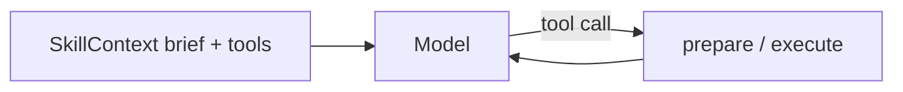

# Skill chaining and registry context

How to combine multiple skills in one host session — model-driven multi-tool routing, host-owned sequential chains, and config-defined named chains.

**Related:** [#330](https://github.com/ARPAHLS/skillware/issues/330) (implementation), [#297](https://github.com/ARPAHLS/skillware/issues/297) (docs), [Agent loops](agent_loops.md), [CLI — context & chain](cli.md#skillware-context), [`.skillware.yaml.example`](../../.skillware.yaml.example)

Skills **never call each other**. The host (your agent loop, script, or `run_chain()`) owns discovery, context assembly, ordering, and each `execute()` call.

---

## Choose your tier

| Tier | Who picks skills | Who picks order | Best for |
| :--- | :--- | :--- | :--- |
| **Single skill** | You | N/A | One tool, one loop ([agent_loops.md](agent_loops.md)) |
| **SkillContext — model routing** | Model (from exposed tools) | Model | Open-ended agents; progressive disclosure |
| **SkillContext — manual chain** | You | Your Python code | Branching, custom error handling, ad hoc pipelines |
| **Named chains (`chains:`)** | You (pick chain name) | YAML steps | Repeatable middleware → domain; CI/scripts |
| **Examples** | Copy from `examples/` | Varies | Provider-specific starter loops |

Use **chain / chains / chaining** for cross-skill host orchestration. Do **not** use framework **`run_pipeline`** (reserved for in-skill actions such as `finance/uk_companies_house_handler`).

---

## Imports

| Need | Import |
| :--- | :--- |
| Registry context (recommended multi-skill entry) | `from skillware import SkillContext` |
| Named chain runner | `from skillware.chains import run_chain, list_chains, load_chain, validate_chain` |
| Single skill (unchanged) | `from skillware.core.loader import SkillLoader` |

`SkillContext` wraps `SkillLoader`; it does not replace it. Existing single-skill scripts keep working unchanged.

---

## SkillContext — discovery filters

`SkillContext` discovers skills the same way as `skillware list`, then assembles brief system text, provider tools, and progressive Directive load on `prepare()` / `execute()`.

### Filter matrix

| Goal | Constructor | Example |
| :--- | :--- | :--- |
| **Entire registry** | Default (no filters) | `SkillContext()` |
| **One skill** | `skill=` | `SkillContext(skill="optimization/prompt_rewriter")` |
| **Explicit list** | `skills=` | `SkillContext(skills=["security/prompt_injection_firewall", "optimization/prompt_rewriter"])` |
| **Category(ies)** | `categories=` | `SkillContext(categories=["security", "compliance"])` |
| **Root tier** | `roots=` | `SkillContext(roots="project")` or `"bundled"`, `"external"`, `"override"` |
| **Custom path** | `roots=` | `SkillContext(roots="/opt/my-skills")` |
| **Exclude tiers** | `exclude_roots=` | `SkillContext(exclude_roots=["external"])` |
| **Optional cap** | `max_skills=` | `SkillContext(max_skills=32)` — emits a warning listing omitted IDs |

Combine filters: `SkillContext(categories=["security"], roots="project", max_skills=10)`.

**Root tiers:** In a dev checkout, skills usually live under `./skills/` (**project**). After `pip install skillware` only, skills come from the wheel (**bundled**). Use `roots="bundled"` to limit to packaged skills; use `roots="project"` for local overrides.

There is **no default cap** on registry size unless you pass `max_skills`.

### Context modes

| Mode | System append | Tools | When to use |
| :--- | :--- | :--- | :--- |
| `brief` (default) | One-line summary per skill | Full schemas | Large registries; model picks tools |
| `tools_only` | Nothing | Full schemas | System prompt owned elsewhere |
| `directives` | Full `instructions.md` per skill | Full schemas | Small fixed skill sets (≤ few skills) |

```python
from skillware import SkillContext

ctx = SkillContext(categories=["security"], mode="brief")
system = ctx.merge_system(host_system_prompt)
tools = ctx.tools("gemini")   # gemini | claude | openai | deepseek
ollama_block = ctx.ollama_prompt  # brief + JSON tool blocks for Ollama prompt mode
```

CLI mirror:

```bash
skillware context show
skillware context show --categories security,compliance --roots project --mode brief
skillware context show --skill optimization/prompt_rewriter --mode directives
skillware context show --export ctx.md
```

---

## SkillContext — progressive disclosure (model picks tools)

When the model selects a tool, load the full Directive before or during execution:

```python
from skillware import SkillContext

ctx = SkillContext()  # entire registry, brief mode
system = ctx.merge_system("You are a helpful agent with Skillware tools.")
tools = ctx.tools("claude")

# ... model returns tool_use for compliance/tos_evaluator ...

prep = ctx.prepare("compliance/tos_evaluator")
# prep.directive — full instructions.md text
# prep.manifest — manifest.json
# prep.bundle — loader bundle

result = ctx.execute("compliance/tos_evaluator", {
    "target_url": url,
    "intended_action": "research documentation",
})
```

- **`execute()` auto-prepares** if you skip `prepare()`.
- **`prepare()`** adds skills outside the initial filter list (lazy expansion).
- **`call()`** is an alias for **`execute()`**.
- One `SkillContext` instance **reuses skill class instances** across calls.

### Host decides the chain (manual Tier 1)

Your code owns branching, retries, and which skill runs next:

```python
from skillware import SkillContext

ctx = SkillContext(skills=[
    "security/prompt_injection_firewall",
    "optimization/prompt_rewriter",
])

fw = ctx.execute(
    "security/prompt_injection_firewall",
    {"source_text": raw_html, "input_mode": "html", "sensitivity": "balanced"},
)

if not fw.get("is_safe"):
    # Host policy: block, log, or return firewall output without compressing
    return fw

rw = ctx.execute(
    "optimization/prompt_rewriter",
    {"raw_text": fw["sanitized_text"], "compression_aggression": "medium"},
)
```

The host can also **choose skills dynamically** (e.g. route to `monitoring/token_limiter` when a budget flag is set) without YAML — same pattern: `ctx.execute(skill_id, params)`.

### Still using SkillLoader directly

Single-skill loops remain valid ([agent_loops.md](agent_loops.md)):

```python
from skillware.core.loader import SkillLoader

bundle = SkillLoader.load_skill("optimization/prompt_rewriter")
skill = bundle["class"]()
result = skill.execute({"raw_text": text, "compression_aggression": "low"})
```

Use `SkillContext` when you need **multiple tools**, **registry brief**, or **shared instances** in one session.

---

## Named chains — predefined YAML pipelines (Tier 2)

Define repeatable order under **`chains:`** in project `.skillware.yaml` or global `~/.config/skillware/config.yaml`. **Project overrides global** on name clash.

See [`.skillware.yaml.example`](../../.skillware.yaml.example) for three reference chains:

| Chain | Purpose |
| :--- | :--- |
| `sanitize_input` | Firewall → rewriter (rewriter skipped when `is_safe` is false) |
| `preflight_untrusted_html` | HTML-mode firewall only |
| `scan_then_gate` | Firewall → token limiter check |

### Python API

```python
from skillware.chains import run_chain, list_chains, validate_chain, load_chain

print(list(list_chains().keys()))

validate_chain("sanitize_input", strict=True)  # CI: raises on structural errors

result = run_chain(
    "sanitize_input",
    host_input={"source_text": untrusted_text},
)
# result.status: ok | partial | failed
# result.steps[i].status: ok | skipped | failed
# result.final — last executed step output (firewall output when rewriter skipped)
# result.errors — tuple of error strings
```

### CLI

```bash
skillware chain list
skillware chain show sanitize_input
skillware chain validate              # all chains
skillware chain validate sanitize_input
skillware chain run sanitize_input --var source_text="hello"
skillware chain run sanitize_input --var source_text=@./page.html --json
skillware chain dry-run scan_then_gate \
  --var source_text=hello --var task_id=job-1 \
  --var current_token_count=12000 --var max_allowed_tokens=32000
```

`--var key=@file` reads file contents as the value (useful for HTML payloads).

### YAML schema (summary)

```yaml
chains:
  sanitize_input:
    description: Scan untrusted text; compress only if safe.
    when: Untrusted text is about to enter model context.   # human doc for operators
    stop_on_error: true   # default true
    steps:
      - id: scan
        skill: security/prompt_injection_firewall
        params:
          sensitivity: balanced
          input_mode: auto
        input_from:
          source_text: host.source_text
        map_out:
          sanitized_text: next.raw_text
      - skill: optimization/prompt_rewriter
        when:
          prior_step: scan
          field: is_safe
          equals: true
        params:
          compression_aggression: medium
```

### Bindings

| Prefix | Resolves to |
| :--- | :--- |
| `host.<key>` | `host_input[key]` (supports dot paths) |
| `next.<param>` | Next step execute param (via prior step `map_out`) |
| `prev.<field>` | Previous **executed** step output (skipped steps do not update `prev`) |

### Step `when:` (conditional skip)

When the condition is false, the step is **skipped** (not an error). Chain status becomes **`partial`** if any step was skipped and none failed.

```yaml
when:
  prior_step: scan    # step id, 0-based index, or earlier skill_id
  field: is_safe      # dot path in that step's output
  equals: true        # strict equality (v1)
```

If `field` is missing in prior output, the condition is treated as false → skip.

### Host picks which named chain

```python
from skillware.chains import list_chains, run_chain

chains = list_chains()
if "preflight_untrusted_html" in chains and content_type == "text/html":
    result = run_chain("preflight_untrusted_html", host_input={"source_text": raw})
else:
    result = run_chain("sanitize_input", host_input={"source_text": raw})
```

The `when:` string on each chain definition is **documentation for operators** (shown in `chain list` / `chain show`), not automatic routing logic.

---

## End-to-end patterns

### Pattern A — Model-routed multi-tool agent



1. `ctx = SkillContext()` or filtered subset.
2. `merge_system()` + `tools(provider)` → model.
3. On tool call: `ctx.execute(skill_id, args)` → return JSON to model.

See [Agent loops — multi-skill sessions](agent_loops.md#multi-skill-sessions-skillcontext).

### Pattern B — Middleware chain in Python

Firewall → domain skill, with host branching (Tier 1 manual chain above).

### Pattern C — Config chain for scripts / CI

`run_chain("scan_then_gate", host_input={...})` or `skillware chain run ...`.

### Pattern D — Hybrid

Expose many tools via `SkillContext`, but run a fixed **`sanitize_input`** chain on untrusted ingest before the model sees content:

```python
from skillware import SkillContext
from skillware.chains import run_chain

sanitized = run_chain("sanitize_input", host_input={"source_text": raw})
text_for_model = sanitized.final.get("sanitized_text") or sanitized.final.get("compressed_text") or raw

ctx = SkillContext(categories=["compliance"])
# ... agent loop with text_for_model as user content ...
```

---

## Provider loops and examples

After wiring `SkillContext` or chains, continue with provider guides and runnable scripts:

- [Agent loops](agent_loops.md) — load / wire / prompt / execute / return
- [examples/README.md](../../examples/README.md) — Gemini, Claude, Ollama, OpenAI reference loops

Multi-skill Ollama harness: `examples/ollama_skills_test.py` (loads several skills; compare with `SkillContext` + `ollama_prompt`).

---

## Backward compatibility

| Guarantee | Detail |
| :--- | :--- |
| `SkillLoader.load_skill()` | Unchanged signature and behavior |
| Existing CLI | `list`, `doctor`, `test`, … unchanged; `context` and `chain` are additive |
| No `chains:` in YAML | Config load identical; `config.chains` is `{}` |
| Legacy `chains: { default: [] }` | Ignored safely (no `steps` key) |
| Opt-in only | Nothing runs until you construct `SkillContext` or call `run_chain()` |

---

## Acceptance (#297 + #330)

This document and the APIs above close [#297](https://github.com/ARPAHLS/skillware/issues/297) (skill chaining guidance) as part of [#330](https://github.com/ARPAHLS/skillware/issues/330) (SkillContext + named chains).
